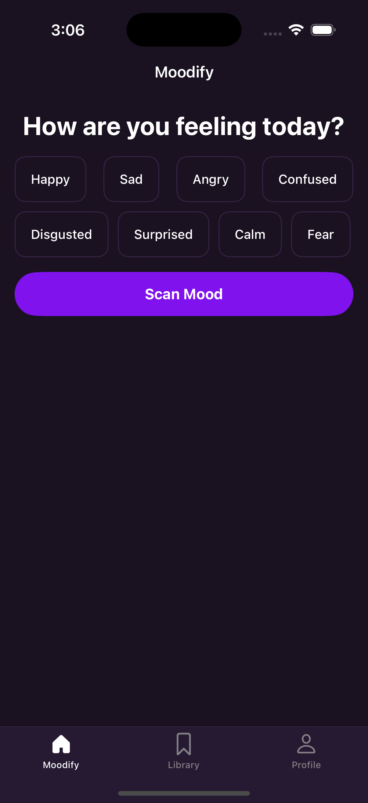
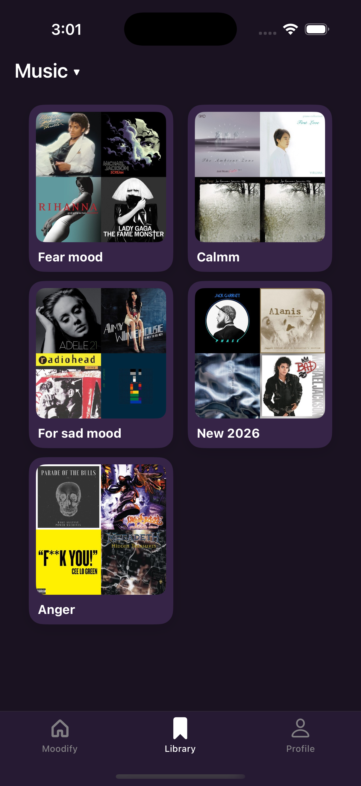

# Moodify

Moodify is a mood-based music and podcast recommendation app that suggests personalized playlists according to the user’s current mood. The app analyzes user preferences and delivers relevant music or podcast playlists in real time. Users can save their favorite playlists and access them anytime. The backend is custom-built to aggregate data from multiple APIs and manage user media securely.

---

## Features

- Personalized music and podcast playlists based on user mood  
- Save and access favorite playlists anytime  
- Onboarding screens for first-time users  
- Authentication with login and signup options  
- Profile view and edit options  
- Real-time recommendations powered by AI

---

## Tech Stack & Design Patterns

- **Frontend:** UIKit, MVVM Architecture  
- **Networking:** Alamofire  
- **APIs:** OpenAI API, YouTube API, iTunes API  
- **Backend:** Node.js  
- **Database & Storage:** Firebase (Firestore & Storage)  
- **Design Patterns:** Singleton, Coordinator, Adapter

---

## Screenshots (Visual Preview)

<p align="center">
  
  
  
  
  
  
</p>

---

## Screenshots with Technology Info

<p align="center">
  <table>
    <tr>
      <td align="center">
        <br/>
          AWS Rekognation(Scan Face for mood)
      </td>
      <td align="center">
        <br/>
         OpenAI API, YouTube API, Node.js backend, WebKit
      </td>
      <td align="center">
        <br/>
           Firebase (Firestore & Storage), UserDefaults
      </td>
    </tr>
  </table>
</p>

---

## Setup / Installation

1. Clone the repository:  
   ```bash
   git clone https://github.com/KananMV/Moodify.git
