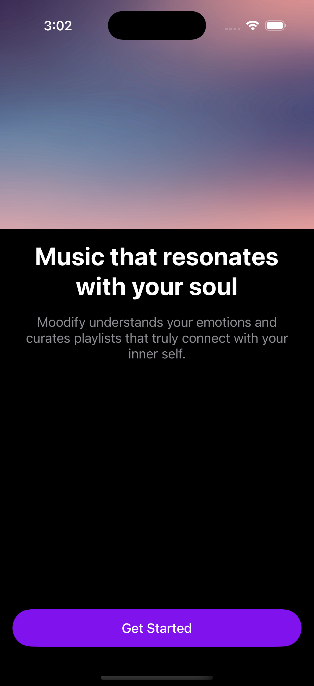
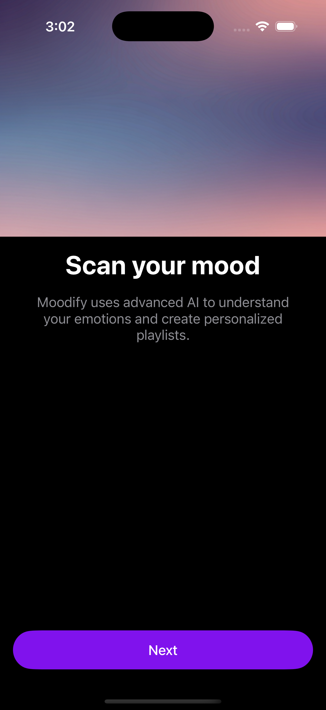
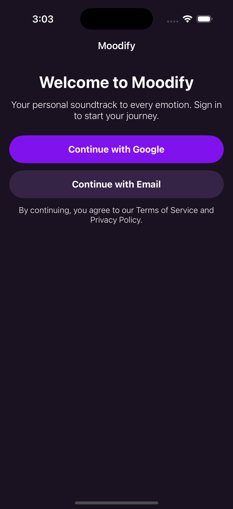
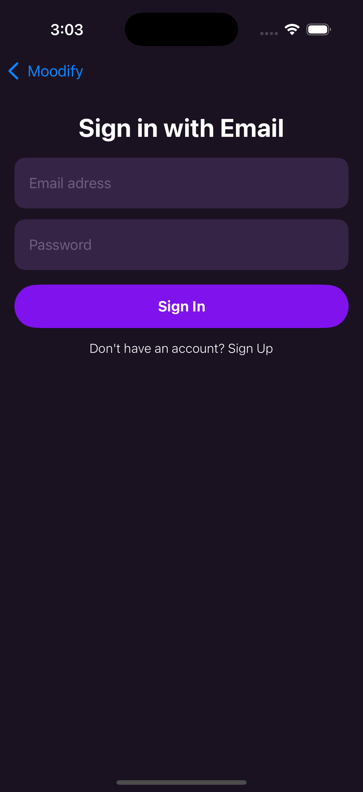
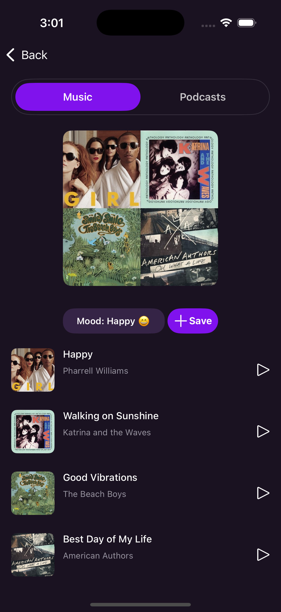
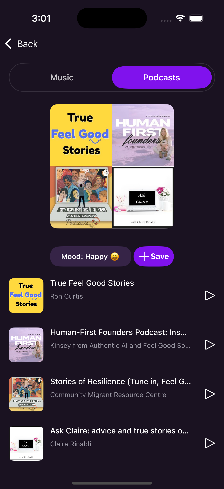
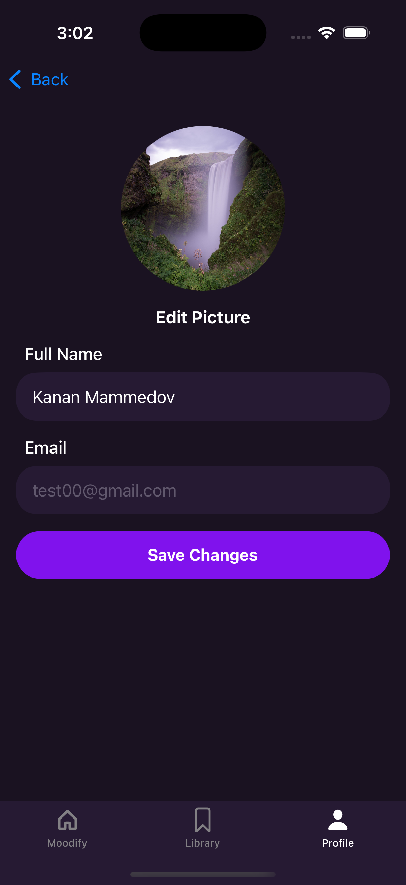

## Screenshots

  
  
  
  

| Screenshot | Technology Used |
|------------|----------------|
|  | UIKit, MVVM, OpenAI API, YouTube API |
|  | UIKit, MVVM, OpenAI API, iTunes API, Node.js backend |
|  | UIKit, MVVM, Firebase (Firestore, Storage) |
